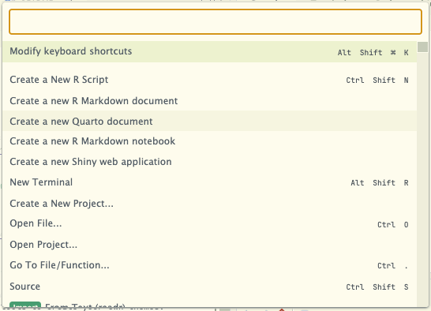
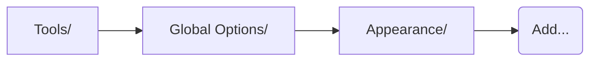

# Everforest for RStudio




# What’s Everforest?

First of all, a big thank you to the creator of the [Everforest
theme](https://github.com/sainnhe/everforest/tree/master), which is
described as:

> 🌲 Comfortable & Pleasant Color Scheme

# What’s `rsthemes`?

[`rsthemes`](https://github.com/gadenbuie/rsthemes) is an R package that
provides

> :crystal_ball: Full RStudio IDE and Syntax Themes

The package not only provides an extensive set of themes to beautify
your RStudio experience, but also provides tools to create your own
themes.

I am indebted to the many contributors to this curated arsenal of
harmonious colors that make staring at R code a much more pleasant
experience. My goal is to submit this theme to be merged into the
`rsthemes` package once I get most of the kinks worked out, but in the
meantime, if you want to try it out you can install this R package from
GitHub with:

``` r
if (!require(rsthemes)) remotes::install_github("gadenbuie/rsthemes")
remotes::install_github("eric-hunt/everforest.rstheme")
# Recursively install all variants (hard, medium, soft)
# of the dark and light versions of the theme with:
purrr::walk(
  c(TRUE, FALSE),
  function(dark) {
    purrr::walk(
      c("hard", "medium", "soft"),
      function(variant) {
        everforest_rstheme(dark = dark, variant = variant, apply = FALSE)
      }
    )
  }
)
# Or, alternatively, just install (and apply) what you want with:
everforest_rstheme(dark = TRUE, variant = "medium", apply = TRUE)
```

Or, you can just download the .rstheme file(s) and import within
RStudio:


